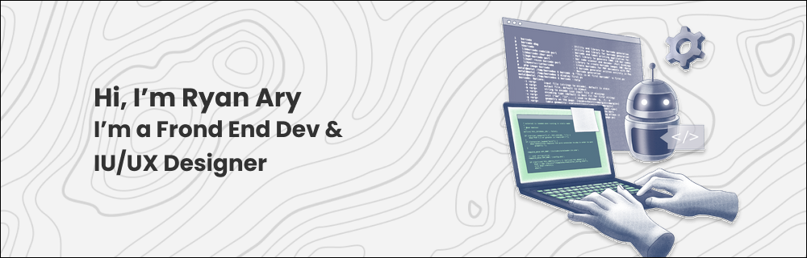

<h1 align="center">Hi, I'm Ryan Ary, Front End Dev & UI/UX Designer</h1>

   
  👨‍🎓 I'm a Student of ITB STIKOM BALI
   
  💻 I love Writing code & Make a UI/UX Designer 😊
   
  📚 I’m currently focusing on Frond End Dev
   
  📫 How to reach me 👇

 <a href="https://www.linkedin.com/in/made-ryan-ary-wiguna/">
 

<h2 align="center">Languages & Frameworks & Tools & Abilities</h2> 

<!---->

